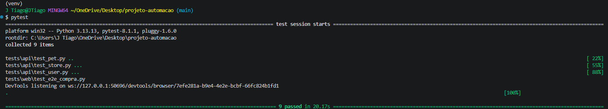
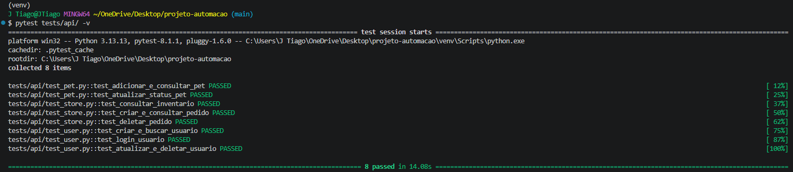
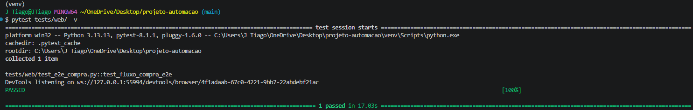

# 🚀 Desafio Técnico - Automação de Testes (API & Web E2E)


Bem-vindo ao repositório do desafio técnico de Engenharia de Qualidade. Este projeto implementa uma suíte de testes automatizados robusta, cobrindo tanto testes de **API REST** quanto testes **End-to-End (E2E) Web**, aplicando boas práticas de arquitetura de software e testes contínuos.

---

## 📑 Índice
- [🎯 Escopo do Projeto](#-escopo-do-projeto)
- [🏗️ Arquitetura e Padrões](#-arquitetura-e-padrões)
- [⚙️ Pré-requisitos e Instalação](#️-pré-requisitos-e-instalação)
- [📸 Evidências e Execução dos Testes](#-evidências-e-execução-dos-testes)
- [🔄 Integração Contínua (CI/CD) e Resiliência](#-integração-contínua-cicd-e-resiliência)

---

## 🎯 Escopo do Projeto

O projeto visa validar as funcionalidades de dois sistemas distintos:

### 1. Automação de API (Swagger Petstore)
Validação dos contratos e regras de negócio da API pública `https://petstore.swagger.io/v2`.
- **User:** Fluxos de criação, busca, atualização, deleção e simulação de autenticação (login/logout).
- **Pet:** Inserção de novos registros, consultas estritas por ID e atualização de status.
- **Store:** Verificação de inventário, geração de pedidos de compra e exclusão de transações.

### 2. Automação Web E2E (SauceDemo)
Validação de interface gráfica e fluxo de usuário no e-commerce fictício `https://www.saucedemo.com/`.
- **Jornada do Cliente:** Autenticação com credenciais válidas, adição de produtos ao carrinho, preenchimento de dados de *checkout* e validação assertiva da tela de sucesso da compra.

---

## 🏗️ Arquitetura e Padrões

O repositório foi construído visando escalabilidade, fácil manutenção e mitigação de *flakiness*:

* **Page Object Model (POM):** Mapeamento de elementos (locators) separado da lógica de asserção nos testes Web.
* **Pytest Fixtures:** Setup e Teardown do *WebDriver* centralizados no arquivo `conftest.py`.
* **Explicit Waits (WebDriverWait):** Sincronização avançada garantindo que o robô aguarde o estado exato dos elementos antes da interação, evitando *timeouts* em ambientes de rede instáveis.
* **Gerenciamento Nativo (Selenium 4+):** Configuração autônoma do ChromeDriver via `ChromeOptions` otimizadas para ambientes *Headless* (`--headless=new`).

---

## ⚙️ Pré-requisitos e Instalação

* [Python 3.11+](https://www.python.org/downloads/) instalado e configurado nas variáveis de ambiente.
* Google Chrome atualizado.

Abra o terminal e execute os comandos referentes ao seu sistema operacional:

### 🪟 Windows
```bash
git clone <link-do-seu-repositorio>
cd projeto-automacao
python -m venv venv
.\venv\Scripts\activate
pip install -r requirements.txt
```

### 🐧 Linux e MacOS
```bash
git clone <link-do-seu-repositorio>
cd projeto-automacao
python3 -m venv venv
source venv/bin/activate
pip install -r requirements.txt
```

---

📸 Evidências e Execução dos Testes
```
O projeto utiliza o framework Pytest para orquestração. Abaixo estão os comandos de execução e as evidências reais de funcionamento da suíte.

1. Suíte Completa (API + Web E2E)
Executa todos os testes do projeto em sequência.

Bash
pytest -v


2. Testes de API
Executa exclusivamente as validações de backend.

Bash
pytest tests/api/ -v


3. Testes Web (E2E)
Executa exclusivamente a automação de interface. (Por padrão, executa em modo Headless. Para visualizar a interface, remova ou comente o argumento --headless=new no conftest.py).

Bash
pytest tests/web/ -v

```
---


🔄 Integração Contínua (CI/CD) e Resiliência
```
Este projeto conta com uma esteira de Integração Contínua ativa via GitHub Actions.
A cada push realizado na branch main, um servidor Ubuntu é provisionado, o ambiente é configurado e a suíte completa de testes é executada.
```
---


🛡️ Mecanismo de Resiliência (Artifacts):
```
Visando facilitar o debugging no ambiente de CI, a automação Web possui um mecanismo de captura de tela embutido (driver.save_screenshot). Caso ocorra qualquer falha durante a jornada de compra, a pipeline irá capturar o momento exato do erro e disponibilizar a imagem para download na aba Artifacts do GitHub, reduzindo drasticamente o tempo de investigação.
```
---